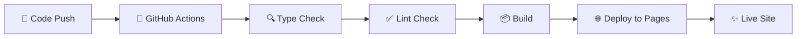

# 🏫 TeacherMBTI - 교사 MBTI 수업 스타일 분석

> 교사들의 수업 스타일을 16가지 MBTI 타입으로 분석하여 더 효과적인 교육 방법을 제시하는 React 웹앱

<div align="center">

[](https://github.com/woody-tiab/TeacherMBTI/actions/workflows/deploy.yml)
[](https://opensource.org/licenses/MIT)
[](https://www.typescriptlang.org/)
[](https://reactjs.org/)
[](https://tailwindcss.com/)

🌐 **[Live Demo](https://woody-tiab.github.io/TeacherMBTI/)** | 📖 **[Documentation](#-개발-가이드)** | 🐛 **[Issues](https://github.com/woody-tiab/TeacherMBTI/issues)**

</div>

## 🎯 프로젝트 개요

**TeacherMBTI**는 교육자들이 자신의 수업 스타일을 이해하고 개선할 수 있도록 돕는 웹 기반 분석 도구입니다. 

### 🌟 핵심 가치
- **📊 정확한 분석**: 24개의 실제 교육 상황 기반 질문으로 정밀한 MBTI 분석
- **🎓 교육 특화**: 일반적인 성격 검사가 아닌 교사의 수업 스타일에 특화된 분석
- **💡 실용적 가이드**: 각 MBTI 타입별 맞춤형 교육 방법론과 개선 방안 제시
- **🎨 직관적 UX**: 누구나 쉽게 사용할 수 있는 반응형 웹 인터페이스

## ✨ 주요 기능

<table>
<tr>
<td width="50%">

### 📋 **MBTI 분석 시스템**
- **24개 교육 상황별 질문** - 실제 수업 환경 반영
- **정밀한 분석 알고리즘** - 4개 차원별 세밀한 측정
- **즉시 결과 제공** - 실시간 분석 결과

### 🎨 **맞춤형 분석 리포트**
- **16가지 MBTI 타입별 분석** - 각 타입의 교육적 특성
- **강점 & 개선점 제시** - 구체적인 발전 방향
- **교육 방법론 가이드** - 타입별 최적 교수법
- **학생 소통 전략** - 효과적인 관계 형성법

</td>
<td width="50%">

### 🎭 **우수한 사용자 경험**
- **Framer Motion 애니메이션** - 부드러운 인터랙션
- **실시간 진행률 표시** - 테스트 진행 상황
- **접근성 완전 준수** - WCAG 2.1 AA 표준
- **직관적 인터페이스** - 누구나 쉬운 사용법

### 🔗 **풍부한 공유 옵션**
- **원클릭 SNS 공유** - 카카오톡, LINE, Facebook, Twitter
- **결과 이미지 저장** - html2canvas 기반 고품질
- **URL 링크 공유** - Web Share API 지원
- **다운로드 기능** - PNG 형태 결과 저장

</td>
</tr>
</table>

## 🚀 기술 스택

<div align="center">

### 💻 Frontend


### 🎨 UI/UX & Animation


### 🔧 Development Tools


</div>

### 📦 주요 라이브러리
- **React Router Dom 6.30.0** - SPA 라우팅 및 네비게이션
- **Custom Hooks** - 상태 관리 및 비즈니스 로직 분리
- **TypeScript Strict Mode** - 엄격한 타입 안전성
- **Terser** - JavaScript 코드 최적화 및 압축

## 🛠 개발 환경 설정

### 📋 필수 요구사항
-  **Node.js 18.0.0 이상**
-  **npm 8.0.0 이상**

### 🚀 빠른 시작

<details>
<summary><b>📥 1단계: 프로젝트 복제 및 설치</b></summary>

```bash
# 프로젝트 클론
git clone https://github.com/woody-tiab/TeacherMBTI.git
cd TeacherMBTI

# 의존성 설치 (약 1-2분 소요)
npm install
```
</details>

<details>
<summary><b>💻 2단계: 개발 서버 실행</b></summary>

```bash
# 개발 서버 실행 (http://localhost:5173)
npm run dev
```
브라우저에서 `http://localhost:5173`으로 접속하여 개발 환경 확인
</details>

<details>
<summary><b>🔧 3단계: 코드 품질 검증</b></summary>

```bash
# TypeScript 타입 체크
npm run type-check

# ESLint 코드 품질 검사
npm run lint

# 코드 스타일 자동 수정
npm run lint:fix
```
</details>

<details>
<summary><b>📦 4단계: 빌드 및 배포</b></summary>

```bash
# 프로덕션 빌드 생성
npm run build

# 빌드 결과 로컬 테스트
npm run preview

# GitHub Pages 배포 (권한 필요)
npm run deploy
```
</details>

## 📦 프로젝트 구조

<details>
<summary><b>🗂️ 전체 프로젝트 구조 (클릭하여 펼치기)</b></summary>

```
TeacherMBTI/
├── 📁 public/                    # 정적 파일
│   ├── vite.svg                  # Vite 로고
│   ├── 404.html                  # SPA 라우팅 지원
│   └── index.html                # HTML 템플릿
├── 📁 src/
│   ├── 📁 components/            # 🧩 React 컴포넌트
│   │   ├── 📁 common/            # 공통 컴포넌트
│   │   │   ├── Button.tsx        # 재사용 버튼 컴포넌트
│   │   │   ├── Card.tsx          # 카드 레이아웃
│   │   │   ├── Loading.tsx       # 로딩 스피너
│   │   │   ├── Navigation.tsx    # 상단 네비게이션
│   │   │   ├── ProgressBar.tsx   # 진행률 표시
│   │   │   ├── QuickActions.tsx  # 빠른 액션 버튼
│   │   │   ├── ShareButton.tsx   # 공유 버튼
│   │   │   ├── ShareDropdown.tsx # 공유 드롭다운
│   │   │   └── Toast.tsx         # 알림 토스트
│   │   ├── 📁 question/          # 질문 관련 컴포넌트
│   │   │   ├── AnswerButton.tsx  # 답변 선택 버튼
│   │   │   ├── QuestionCard.tsx  # 질문 카드
│   │   │   └── QuestionNavigation.tsx # 질문 네비게이션
│   │   └── 📁 result/            # 결과 관련 컴포넌트
│   │       ├── CompleteResults.tsx    # 완전한 결과 페이지
│   │       ├── ResultCard.tsx         # 결과 카드
│   │       ├── ScoreChart.tsx         # 점수 차트
│   │       ├── TeachingStyleInfo.tsx  # 교수 스타일 정보
│   │       └── TypeDescription.tsx    # 타입 설명
│   ├── 📁 pages/                 # 📄 페이지 컴포넌트
│   │   ├── HomePage.tsx          # 🏠 메인 페이지
│   │   ├── TestPage.tsx          # 📝 테스트 페이지
│   │   └── ResultPage.tsx        # 📊 결과 페이지
│   ├── 📁 types/                 # 🏷️ TypeScript 타입 정의
│   │   └── mbti.ts               # MBTI 관련 타입
│   ├── 📁 data/                  # 📚 정적 데이터
│   │   ├── questions.ts          # MBTI 질문 데이터
│   │   └── results.ts            # MBTI 결과 데이터
│   ├── 📁 utils/                 # 🛠️ 유틸리티 함수
│   │   ├── mbti.ts               # MBTI 계산 로직
│   │   ├── share.ts              # 공유 기능
│   │   └── secureStorage.ts      # 보안 저장소
│   ├── 📁 hooks/                 # 🎣 커스텀 훅
│   │   └── useMBTITest.ts        # MBTI 테스트 상태 관리
│   ├── 📁 constants/             # 🔒 상수 정의
│   │   ├── shareText.ts          # 공유 텍스트
│   │   ├── socialPlatforms.tsx   # 소셜 플랫폼
│   │   └── styles.ts             # 스타일 상수
│   ├── App.tsx                   # 🚀 메인 앱 컴포넌트
│   ├── main.tsx                  # 📍 엔트리 포인트
│   └── index.css                 # 🎨 글로벌 스타일
├── 📁 .github/workflows/         # 🤖 CI/CD
│   └── deploy.yml                # GitHub Actions 워크플로우
├── vite.config.ts                # ⚙️ Vite 빌드 설정
├── tailwind.config.js            # 🎨 TailwindCSS 설정
├── tsconfig.json                 # 📘 TypeScript 설정
├── package.json                  # 📦 프로젝트 메타데이터
├── CLAUDE.md                     # 🤖 Claude Code 개발 가이드
└── README.md                     # 📖 프로젝트 문서
```
</details>

### 🏗️ 아키텍처 설계

<table>
<tr>
<td width="50%">

#### 📱 **프론트엔드 아키텍처**
- **컴포넌트 기반** - 재사용 가능한 모듈화된 구조
- **Custom Hooks** - 비즈니스 로직과 UI 분리
- **TypeScript** - 타입 안전성 보장
- **TailwindCSS** - 일관된 디자인 시스템

</td>
<td width="50%">

#### 🔄 **상태 관리 패턴**
- **useMBTITest Hook** - 중앙화된 테스트 상태
- **React Context** - 전역 상태 관리
- **Local State** - 컴포넌트별 UI 상태
- **URL State** - 결과 공유를 위한 URL 파라미터

</td>
</tr>
</table>

## 🌐 배포 및 성능

### 🚀 **자동 배포 시스템**



#### 배포 프로세스
1. **`main` 브랜치 Push** → 자동 트리거
2. **품질 검증** → TypeScript + ESLint 검사
3. **빌드 생성** → Vite 프로덕션 빌드
4. **배포 완료** → GitHub Pages 자동 업데이트

#### 수동 배포
```bash
# 전체 빌드 및 배포 프로세스 실행
npm run deploy
```

### ⚡ **성능 최적화 전략**

<table>
<tr>
<td width="50%">

#### 🎯 **번들 최적화**
- **Code Splitting** - vendor/app 코드 분리
- **Tree Shaking** - 미사용 코드 자동 제거
- **Dynamic Import** - 필요시 동적 로딩
- **Terser 압축** - JavaScript 코드 최적화

</td>
<td width="50%">

#### 📊 **성능 목표 지표**
- **Lighthouse Score**: 95+ 목표
- **Bundle Size**: < 500KB (gzipped)
- **FCP**: < 1.5초
- **LCP**: < 2.5초
- **CLS**: < 0.1

</td>
</tr>
</table>

> 💡 **성능 측정 도구**: [Chrome DevTools Lighthouse](https://developers.google.com/web/tools/lighthouse) 또는 [PageSpeed Insights](https://pagespeed.web.dev/) 사용 권장

## 🔧 개발 가이드

### 📝 **코딩 표준**
<table>
<tr>
<td width="50%">

#### **언어 & 프레임워크**
- ✅ **TypeScript Strict Mode** 필수
- ✅ **함수형 컴포넌트** + React Hooks
- ✅ **TailwindCSS** 전용 (CSS-in-JS 금지)
- ✅ **ESLint 규칙** 100% 준수

</td>
<td width="50%">

#### **컴포넌트 규칙**
- ✅ **PascalCase** 네이밍
- ✅ **Props Interface** 필수 정의
- ✅ **Default Export** 선호
- ✅ **TypeScript** - `any` 타입 금지

</td>
</tr>
</table>

### 🏷️ **커밋 메시지 컨벤션**
```bash
feat: ✨ 새로운 기능 추가
fix: 🐛 버그 수정
docs: 📚 문서 수정
style: 💄 코드 포맷팅 (기능 변경 없음)
refactor: ♻️ 코드 리팩토링
test: ✅ 테스트 코드 추가/수정
chore: 🔧 빌드 설정, 패키지 등
perf: ⚡ 성능 개선
```

### 🌿 **Git 브랜치 전략**
```
main           ──●──●──●──●── (프로덕션 배포)
                  │     │
develop       ────●──●──●──── (개발 통합)
                  │  │  │
feature/login ────●──●──    (기능 개발)
hotfix/urgent ───────●──    (긴급 수정)
```

## 🧪 QA 및 테스트

### ✅ **품질 검증 체크리스트**
<details>
<summary><b>📋 기능 테스트 항목 (클릭하여 펼치기)</b></summary>

#### 📝 **MBTI 테스트 기능**
- [ ] 24개 질문 모두 정상 표시 확인
- [ ] 답변 선택 시 시각적 피드백 정상 동작
- [ ] 이전/다음 네비게이션 버튼 정상 동작
- [ ] 진행률 바 실시간 업데이트 확인
- [ ] 결과 페이지 정확한 MBTI 타입 표시

#### 🔗 **공유 기능**
- [ ] URL 복사 기능 동작 확인
- [ ] SNS 공유 버튼 (카카오톡, LINE, Facebook, Twitter) 동작
- [ ] 결과 이미지 생성 및 다운로드 기능
- [ ] Web Share API 지원 여부

#### 📱 **반응형 & 접근성**
- [ ] 모바일 (320px~767px) 레이아웃 확인
- [ ] 태블릿 (768px~1023px) 레이아웃 확인
- [ ] 데스크톱 (1024px+) 레이아웃 확인
- [ ] 키보드 네비게이션 가능 여부
- [ ] 스크린 리더 호환성 확인
- [ ] 터치 인터페이스 사용성 확인

#### 🌐 **브라우저 호환성**
- [ ] Chrome (최신 버전)
- [ ] Firefox (최신 버전)
- [ ] Safari (iOS/macOS)
- [ ] Edge (최신 버전)

</details>

## 🤝 기여하기

<div align="center">

### 🚀 **기여 프로세스**

```
1️⃣ Fork → 2️⃣ Branch → 3️⃣ Code → 4️⃣ Test → 5️⃣ PR
```

</div>

<details>
<summary><b>📖 상세 기여 가이드</b></summary>

1. **저장소 Fork**
   ```bash
   # GitHub에서 Fork 후 로컬 클론
   git clone https://github.com/YOUR_USERNAME/TeacherMBTI.git
   ```

2. **기능 브랜치 생성**
   ```bash
   git checkout -b feature/amazing-feature
   ```

3. **코드 작성 및 커밋**
   ```bash
   git commit -m 'feat: Add amazing feature'
   ```

4. **테스트 실행**
   ```bash
   npm run type-check && npm run lint
   ```

5. **Push 및 PR 생성**
   ```bash
   git push origin feature/amazing-feature
   ```

</details>

## 📈 로드맵

<table>
<tr>
<td width="50%">

### 🎯 **v1.1.0** *(개발 예정)*
- [ ] 🔄 **PWA 지원 완료** - 오프라인 사용 가능
- [ ] 💾 **결과 저장 기능** - 로컬 저장소 활용
- [ ] 📊 **통계 대시보드** - 사용 패턴 분석
- [ ] 🔔 **알림 시스템** - 푸시 알림 지원

</td>
<td width="50%">

### 🌟 **v1.2.0** *(장기 계획)*
- [ ] 🌍 **다국어 지원** - 영어, 일본어 추가
- [ ] 🌙 **다크 모드** - 테마 변경 기능
- [ ] 📋 **상세 분석 리포트** - PDF 다운로드
- [ ] 👥 **팀 분석 기능** - 그룹 결과 비교

</td>
</tr>
</table>

## 📞 지원 및 문의

<div align="center">

[](https://github.com/woody-tiab/TeacherMBTI/issues)
[](https://github.com/woody-tiab/TeacherMBTI/discussions)

**📝 [이슈 등록](https://github.com/woody-tiab/TeacherMBTI/issues/new)** | **💬 [토론 참여](https://github.com/woody-tiab/TeacherMBTI/discussions)** | **🐛 [버그 신고](https://github.com/woody-tiab/TeacherMBTI/issues/new?template=bug_report.md)**

</div>

---

<div align="center">

### 📄 **라이선스**

이 프로젝트는 [MIT License](https://opensource.org/licenses/MIT)로 배포됩니다.

**Made with ❤️ by [Kimwoody](https://github.com/woody-tiab)**

⭐ 프로젝트가 도움이 되셨다면 스타를 눌러주세요!

</div> 